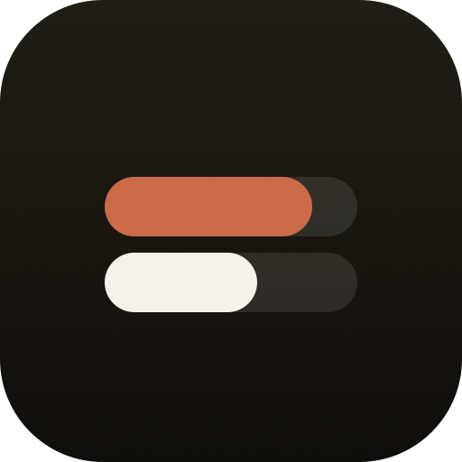
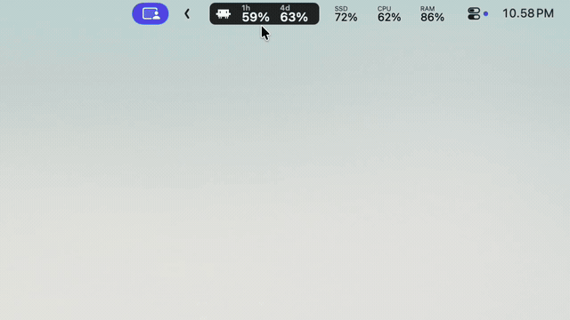

<p align="center">
  
</p>

<h1 align="center">ClaudexBar</h1>

<p align="center">
  Codex &amp; Claude Code usage limits in your macOS menu bar — zero-config, native, dependency-free.
</p>

<p align="center">
  <a href="https://github.com/ipangdz/claudexbar/actions/workflows/ci.yml"></a>
  <a href="LICENSE"></a>
  
</p>

A small native macOS menu-bar app that shows **Codex** and **Claude Code** usage limits at a glance. Zero-config: it reuses your existing CLI login, shows each provider's session (5-hour) and weekly windows, and warns before you run low — no API keys, no browser cookies, no dependencies.

## Demo

<p align="center">
  <br>
  <em>Codex &amp; Claude Code usage right in the menu bar — right-click for the menu, hold ⌥ Option for re-auth.</em>
</p>

## Features

- Native AppKit menu bar app with no Dock icon and no main window.
- Two providers only: Codex and Claude Code.
- Codex auth from `~/.codex/auth.json`. Claude Code auth from a ClaudexBar-managed OAuth credential in Keychain (`ClaudexBar-Claude-Credentials`), falling back to `CLAUDE_CODE_OAUTH_TOKEN` and Claude Code's own `Claude Code-credentials` login.
- Re-auth: Codex opens `codex login` in Terminal; Claude Code opens your browser to Claude's sign-in page. After you approve, Claude shows a one-time code — paste it into the ClaudexBar dialog and it stores its own access+refresh credential (no Terminal).
- Configurable refresh interval and remaining-usage notifications.
- No telemetry, analytics, or browser cookies. The only value you paste is the one-time Claude authorization code, which is exchanged for a token and never stored.

## Install

Works on **both Apple Silicon and Intel** Macs (macOS 13+).

### Homebrew (prebuilt)

```bash
brew install --cask ipangdz/tap/claudexbar
```

A universal, prebuilt `.app` — no toolchain required.

### From source (one line)

Builds a native binary for your machine; needs the Xcode Command Line Tools (`xcode-select --install`), which provide `git` and the Swift toolchain.

```bash
curl -fsSL https://raw.githubusercontent.com/ipangdz/claudexbar/main/scripts/install.sh | bash
```

Or from a checkout:

```bash
git clone https://github.com/ipangdz/claudexbar.git && cd claudexbar
./scripts/install.sh
```

Either way, the installer builds the release binary, assembles `~/Applications/ClaudexBar.app` (with its icon), ad-hoc code-signs it, installs `~/.local/bin/claudexbar`, writes a LaunchAgent, and starts it. To update later, just run the one-liner again.

Because it builds from source on your own machine, no Apple Developer account, certificate, or notarization is required. (A prebuilt, notarized `.dmg` would need an Apple Developer ID — a possible future option.) The app is a menu-bar accessory (`LSUIElement`), so its icon appears in Finder/Spotlight rather than the Dock.

## Development

```bash
swift build
swift run ClaudexBarTestRunner
```

`ClaudexBarTestRunner` covers reset-label formatting, live countdown rendering, Codex and Claude response parsing, notification threshold decisions, one-notification-per-window-cycle deduping, and cross-provider hints.

## Uninstall

```bash
./scripts/uninstall.sh
```

Uninstall removes the ClaudexBar binary, LaunchAgent, app settings, and logs. It does not touch Codex or Claude Code credentials.

## Usage

ClaudexBar can switch providers automatically: when both providers are enabled, it watches lightweight local context (foreground app/window text and recent Codex/Claude session-file activity) and switches only after one provider has been the clear winner for a short debounce window. It does not use CPU usage or shell process scans as deciding signals.

The right-click menu can also check and update the installed Claude Code and Codex CLIs. **Daily Auto-update** uses a low-priority macOS LaunchAgent and the CLIs' own `update` commands; turning it off removes only ClaudexBar's updater job. Claude Code may still use its own native auto-updater.

Left-click the pill to cycle between enabled providers. Manual clicks still work in auto mode and temporarily pin your choice so the pill does not jump around while you move between tools. If only one provider is enabled, left-click leaves that provider selected. Right-click for the menu.

The right-click menu lists the two providers, Codex and Claude Code, as 1-click checkbox rows:

- The checkbox toggles whether the provider is enabled (both enabled → left-click cycles between them; only one enabled provider → ClaudexBar stays on it; none enabled → paused/off).
- The row shows that provider's live usage (`5h% · 7d%`), or a status word (`auth` / `net` / `err`) when there is a problem.
- Re-auth actions are exposed through ⌥ Option alternates.
- **Hold ⌥ Option** to swap **Open Logs…** into the maintenance area.

Below the providers are Refresh All, Smart Auto Switch, Launch at Login, Refresh Interval, and Notify When Remaining.

The left usage column is the current session window. The right column is the weekly budget. Session usage also chips away at the weekly budget.

## Troubleshooting

- `auth` for Codex: run `codex login`.
- `auth` for Claude Code: choose `Re-auth` → `Claude Code` from the ClaudexBar menu. Your browser opens to Claude's sign-in page (`claude.com/cai/oauth/authorize`). Approve access; Claude's callback page then shows a one-time `code#state` string. Copy it and paste it into the ClaudexBar dialog (it pre-fills from your clipboard when it recognises a code). ClaudexBar exchanges it for an access+refresh credential — with the full scopes the usage endpoint needs — stored in the Keychain service `ClaudexBar-Claude-Credentials`, then refreshes usage. The code and tokens are never logged.
- Why a paste (and not a fully automatic flow): Claude's OAuth client does not accept a `localhost` redirect, so the authorization code is returned to Claude's own callback page rather than to ClaudexBar directly. The one paste bridges that page back to the app.
- Why a separate credential: Claude Code's own `Claude Code-credentials` login rotates its refresh token on every refresh, so a background menu-bar app reading that snapshot would be invalidated whenever Claude Code refreshes (and vice versa). ClaudexBar runs its own OAuth sign-in to get an independent credential it refreshes on its own (the access token lasts ~8 hours and is refreshed automatically).
- `login` stuck in the pill: the code exchange is still running or failed. Check `auth` afterwards and re-run `Re-auth` → `Claude Code`.
- `auth` right after re-auth: the paste may have been incomplete. Re-run and paste the entire `code#state` string from Claude's page.
- If you want terminal Claude Code sessions to use a manually generated token too, set:

  ```bash
  export CLAUDE_CODE_OAUTH_TOKEN='<token>'
  ```

- Claude `err`/HTTP 403: the stored credential lacks a required scope. Run `Re-auth` → `Claude Code` again — ClaudexBar requests the correct scope set itself. (Note: `claude setup-token` is **not** used; its token has too narrow a scope for the usage endpoint. See [docs/AUTH.md](docs/AUTH.md).)
- `net`: the usage endpoint could not be reached or may be rate limited. Use the provider's `Refresh` from the menu a little later.

## Non-goals

- No history graphs.
- No cost estimation.
- No embedded/in-app web view: sign-in happens in your real browser via the official CLI.
- No additional providers in MVP.

## Documentation

- [docs/AUTH.md](docs/AUTH.md) — how Codex and Claude Code authentication work, and why.
- [SECURITY.md](SECURITY.md) — security model and how to report a vulnerability.
- [CHANGELOG.md](CHANGELOG.md) — release notes.

## Contributing

Contributions are welcome — see [CONTRIBUTING.md](CONTRIBUTING.md). The project is
deliberately narrow (Codex + Claude Code only) and dependency-free.

## License

[MIT](LICENSE).
